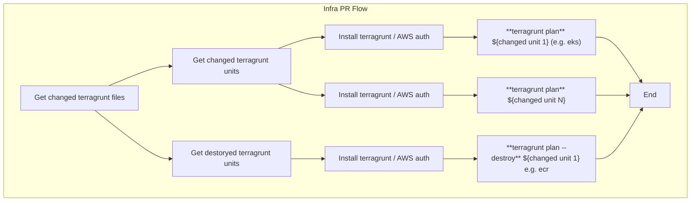
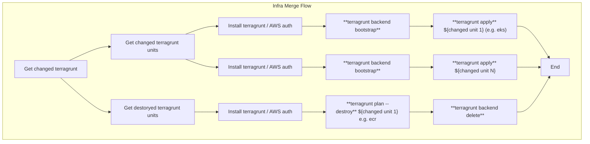
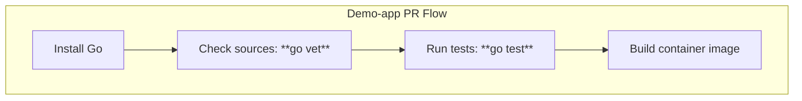
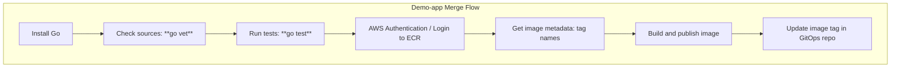

# Demo-app
**This demo-app project consists of:**
* [Infrastructure provisioning](#infrastructure) with Terragrunt units and Terraform modules
* [Trivial Go app](#app), that provides info about it's environment
* [Simple CI/CD](#cicd) for infrastructure provisioning with GitHub Actions
* [GitOps CD](#gitops) for application with Flux and Canary deployments
* [Active/Active DR](#disaster-recovery) deployment to two AWS regions

### Architecture

### Infrastructure
##### Terragrunt
- [Terragrunt units](https://github.com/vnedvyga/demo-app/tree/main/infra/environments/prod) deploy following resources from public modules on two regions : vpc, eks, ecr
- [Global Terragrunt units](https://github.com/vnedvyga/demo-app/tree/main/infra/environments/prod/global) deploy following resources from public modules: global accelerator
- [Terragrunt unit's common (across units) configuration](https://github.com/vnedvyga/demo-app/tree/main/infra/environments/_common)
###### Areas for improvement
- **IAM**: add units for IAM roles; use dedicated (with fine-grained permissions) IAM roles during units deployments;
##### Terraform
Terraform [_"kubernetes"_ module](https://github.com/vnedvyga/demo-app/tree/main/infra/modules/kubernetes) provisions required k8s controllers and supporting aws resources: flux (gitops engine), aws lb controller (for required NLB setup settings), aws pod identity resources for aws lb controller, contour api gateway, api gateway resources (from embedded [_"api_gateway"_ helm chart](https://github.com/vnedvyga/demo-app/tree/main/infra/modules/kubernetes/charts/api-gateway)), flagger (canary deployments), loadtester (used to generate traffic during canary rollouts)
###### Areas for improvement
- **CI/CD**: add CI/CD for local module, optionally with tests (terratest);

### CI/CD
CI/CD is done with GitHub actions on public runners. Authertication between GitHub and AWS is performed with OIDC. For terraform infrastructure deployments in prod environments other tools are usually used (Example: Atlantis, Terraform Cloud), but since out application CI/CD flow is too simplistic in terms of pipeline/workflow structure (due to GitOps usage) and those tools require additional resources to be de deployed - decided to build a custom CI/CD pipeline for infrastructure.
#### Infrastructure PR Flow: [Pipeline](https://github.com/vnedvyga/demo-app/blob/main/.github/workflows/infra_pr_flow.yml); [Example with resource creation](https://github.com/vnedvyga/demo-app/actions/runs/19768979306); [Example with resource destruction](https://github.com/vnedvyga/demo-app/actions/runs/19769248397);

#### Infrastructure Merge Flow: [Pipeline](https://github.com/vnedvyga/demo-app/blob/main/.github/workflows/infra_merge_flow.yml); [Example with resource creation](https://github.com/vnedvyga/demo-app/actions/runs/19770274775); [Example with resource destruction](https://github.com/vnedvyga/demo-app/actions/runs/19769272833);

#### Application PR Flow: [Pipeline](https://github.com/vnedvyga/demo-app/blob/main/.github/workflows/app_pr_flow.yml); [Example run](https://github.com/vnedvyga/demo-app/actions/runs/19771025906);

#### Application Merge Flow: [Pipeline](https://github.com/vnedvyga/demo-app/blob/main/.github/workflows/infra_merge_flow.yml); [Example run](https://github.com/vnedvyga/demo-app/actions/runs/19771070338);

###### Areas for improvement
- **Infrastructure**: make sure terraform _plan_ is propagated from PR flow to Merge flow; deploy units in order, based on dependency graph.
### GitOps
GitOps deployment with Flux and Kustomize:
- [Application base](https://github.com/vnedvyga/demo-app/tree/main/deploy/apps/base/demo-app)
- [Environment overlay](https://github.com/vnedvyga/demo-app/tree/main/deploy/apps/production)
- [Flux monitored clusters](https://github.com/vnedvyga/demo-app/tree/main/deploy/clusters/)

[Canary deployments](https://github.com/vnedvyga/demo-app/blob/main/deploy/apps/base/demo-app/canary.yaml) are performed with analysis based on _error-rate_ [metric](https://github.com/vnedvyga/demo-app/blob/main/deploy/apps/base/demo-app/metrics.yaml) (provided from api-gateway's envoy), collected from _prometheus_ deployed by _flagger_ (canary deployment engine)

### App 
Simple [Go web app](https://github.com/vnedvyga/demo-app/tree/main/demo-app), provides a number of endpoints to help with canary or DR checks:
- root url displays region that served the request and container image that is deployed
- endpoint to generate 5xx error to fail canary progression
- healthcheck endpoint
###### Areas for improvement
 - expose app level metrics with open telemetry to remove dependency on infra-level metrics
 - add some real logic with temporal workflows

### Disaster recovery 
Current setup uses Active/Active architecture with two EKS clusters in separate regions behind AWS Global Accelerator.
###### Areas for improvement
- Change to _warm-standby_ with automatic failover
